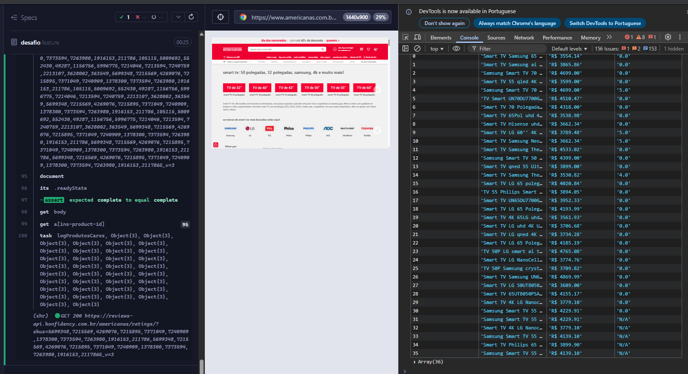
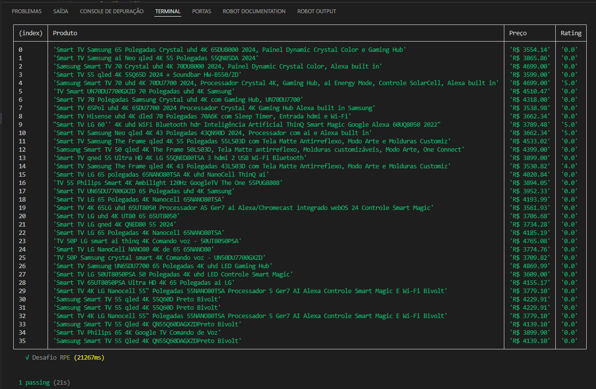

# Desafio de Automação
Projeto de automação utilizando o cypress para seleção em QA, onde visa testar as habilidades em automação de frontend.
Site utilizado para execução dos testes: https://www.americanas.com.br/
Este projeto tem como objetivo desenvolver um cenário onde o usuário acessa o site, faz uma pesquisa pelo produto "Smart TV", logo após faz uma filtragem por produtos em uma determinada faixa de preço (R$ 2.500 - R$ 5.000). Feito isso, a automação deve percorrer toda a lista de produtos, salvar aqueles que são maiores que R$ 3.500 e mostrar numa lista esses produtos com as seguintes informações: Nome, Preço e Ratin de Avaliação

# Preparação do Ambiente
Para este projeto foram utilizados as seguintes tecnologias/ferramentas/bibliotecas e versões:
- Node.Js v22.12.0
- Cypress v14.4.1
- Cucumber v4.3.1
- Visual Studio Code

# Instalações
Instalação do Node
- Baixar e instalar o nvm-setup
- Executar o comando: nvm install 22.12.0
- Para verificar se a versão correta está instalada, execute o comando: `node -v`

Instalação do Cypress
- Dentro do diretório do projeto, abrir o terminal e rodar o comando: `npm install cypress --save-dev`
- Para verificar se a instalação está correta, execute o cypress com o comando: `npx cypress open`

Instalação do Cucumber
- Dentro do diretório do projeto, abrir o terminal e rodar o comando: `npm install --save-dev cypress cypress-cucumber-preprocessor`

Instalação do Visual Studio Code
- Entrar na página oficial e seguir os passos de instalação padrão: https://code.visualstudio.com/

# Informações para executar a automação
- Clonar o repositório no diretório local desejado;
- Abrir o terminal dentro da raiz do projeto e executar o comando: `npm install` para que seja criada a pasta node_modules e instalar todas as dependências do projeto;
- Para iniciar o cypress, execute o comando: `npx cypress open`
- Com a tela do cypress aberta, clique para executar os testes E2E;
- Na tela seguinte escolha o navegador em que deseja rodar os testes e clique para dar o "Start"
- Exemplo de execução pelo navegador
  

# Informações para executar a automação no modo headless
- Clonar o repositório no diretório local desejado;
- Abrir o terminal dentro da raiz do projeto e executar o comando: `npm install` para que seja criada a pasta node_modules e instalar todas as dependências do projeto;
- Execute o comando: `npx cypress open`
- Note que os testes serão executados no terminal, gerando uma tabela com as informações.
- Exemplo de execução pelo terminal
  
